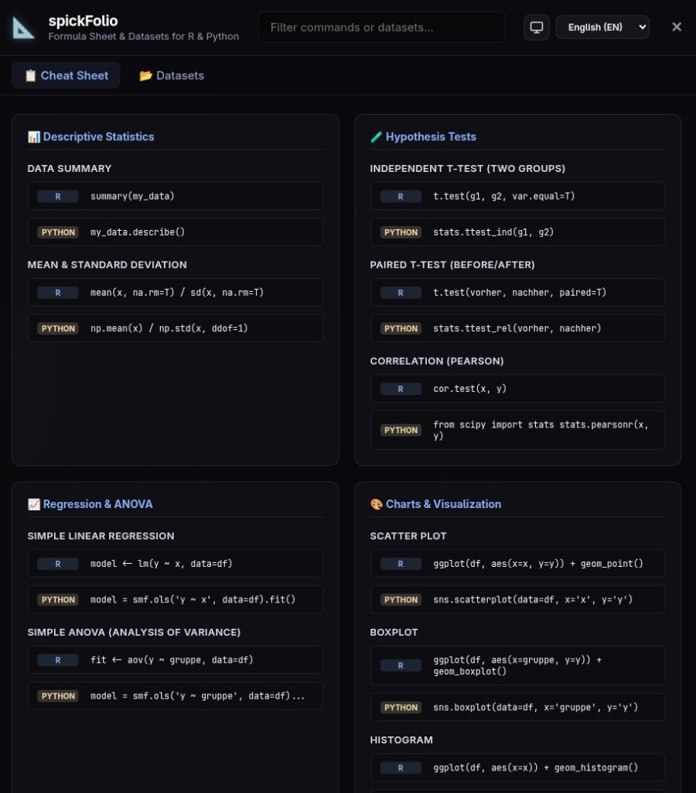
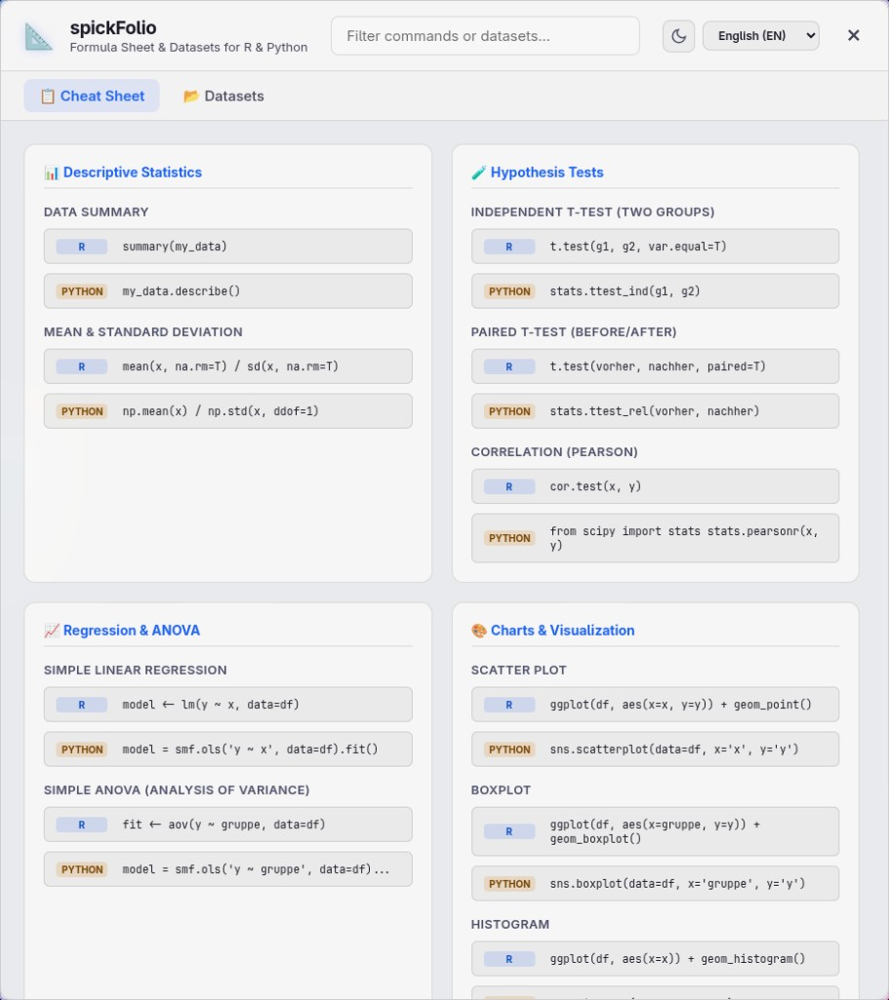
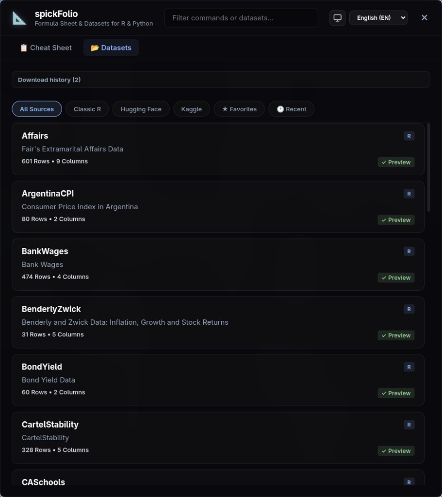
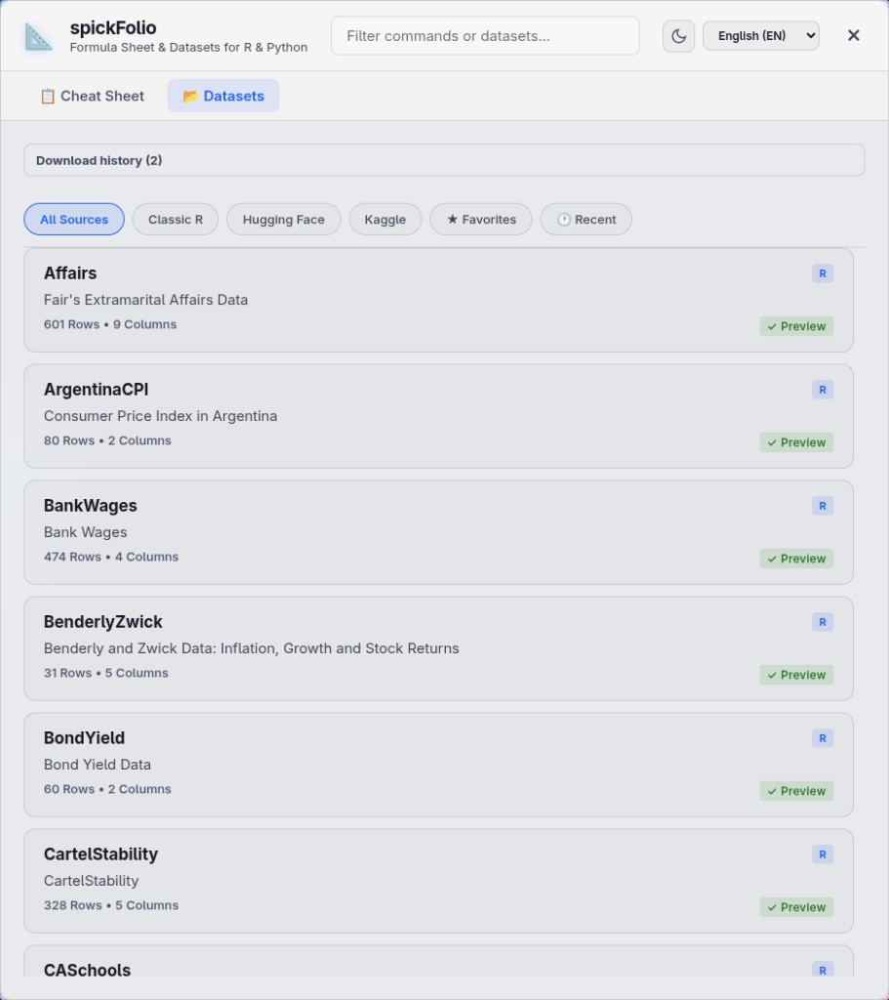
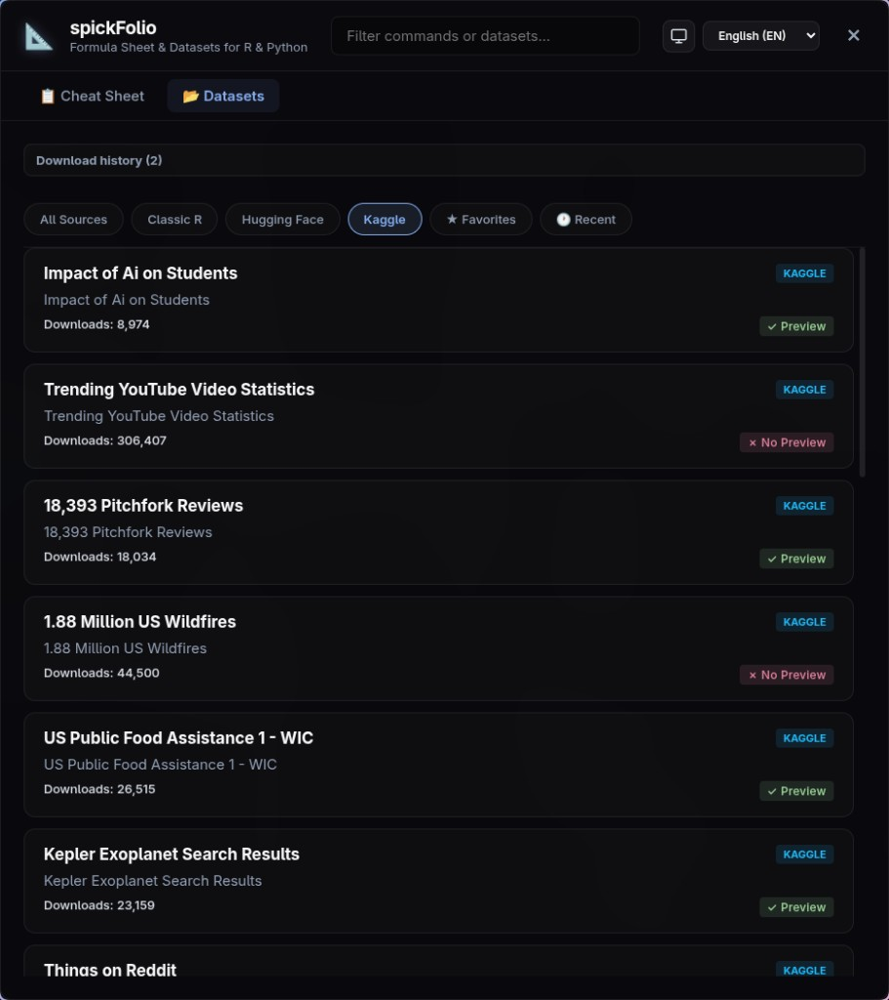
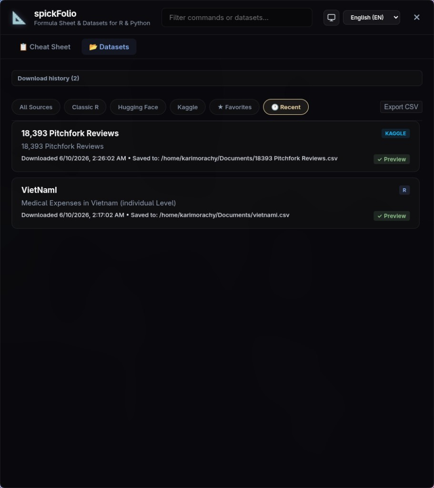

# spickFolio

Ein schwebendes Overlay für R/Python-Statistik-Spickzettel und Dataset-Browser/Downloader mit Rdatasets, Hugging Face und Kaggle.

An interactive floating overlay for R/Python statistics cheat sheets and a dataset browser/downloader with Rdatasets, Hugging Face and Kaggle support.

**Repository:** https://github.com/Karim-Termanini/spickfolio

## Screenshots

### Cheat Sheet (dark / light)

Side-by-side R and Python snippets for descriptive statistics, hypothesis tests, regression, ANOVA, and charts.

| Dark | Light |
|---|---|
|  |  |

### Datasets — Classic R (dark / light)

Browse 3500+ Rdatasets with search, source filters, and inline preview.

| Dark | Light |
|---|---|
|  |  |

### Datasets — Kaggle

Filter by source; preview available datasets before download.



### Download history

Recent downloads with export to CSV.



---

## Requirements

**Installers (recommended):** Chrome, Edge, or Firefox — no Python required.

**From source:** Python 3.10+, Linux or Windows 10/11, and a browser.

Optional (not bundled): `R` (RData/RDS export), Kaggle API token, `pyarrow` (Parquet preview)

---

## Install (no terminal)

Download installers from [GitHub Actions artifacts](https://github.com/Karim-Termanini/spickfolio/actions) or [Releases](https://github.com/Karim-Termanini/spickfolio/releases).

| Platform | Installer | What to do |
|----------|-----------|------------|
| **Windows** | `spickFolio-Setup-1.0.0.exe` | Run the setup wizard → Start Menu / optional desktop shortcut → launch **spickFolio** |
| **Linux (any distro)** | `spickFolio-1.0.0-x86_64.AppImage` | Double-click the AppImage (or right-click → Allow launching, once) |
| **Ubuntu / Debian** | `spickfolio_1.0.0_amd64.deb` | Double-click the `.deb` → install in Software Center → launch from app menu |

All installers bundle Python and the app. No separate Python install required.

---

## Quick start (Windows, from source)

**Option A — portable executable:**

1. Download `spickFolio.exe` from Actions / Releases.
2. Double-click to launch.

**Option B — from source (Python required):**

```powershell
git clone https://github.com/Karim-Termanini/spickfolio.git
cd spickfolio
.\launch-spickfolio.bat
```

Or: `.\launch-spickfolio.ps1`

Server only: `.\launch-spickfolio.bat --server-only` then open `http://127.0.0.1:18700/`

Build installers yourself:

```powershell
# Windows setup wizard
.\installer\build-windows-installer.ps1
# Output: dist\spickFolio-Setup-1.0.0.exe
```

Runtime cache and optional Kaggle venv: `%USERPROFILE%\.cache\spickfolio\`

---

## Quick start (Linux, from source)

```bash
git clone https://github.com/Karim-Termanini/spickfolio.git
cd spickfolio
./launch-spickfolio.sh
```

Build the Linux installers (AppImage + `.deb`):

```bash
./installer/build-linux-installer.sh
# Output: dist/spickFolio-1.0.0-x86_64.AppImage, dist/spickfolio_1.0.0_amd64.deb
```

### Application menu entry (dev checkout only)

```bash
./install-desktop-entry.sh
```

Then launch **spickFolio** from your desktop environment's app menu.

### Global keyboard shortcut (Super+Shift+S)

```bash
./install-global-shortcut.sh
```

Hyprland and GNOME are configured automatically. Other desktops get printed setup steps. Remove with `./install-global-shortcut.sh --remove`.

### Server only (open URL yourself)

```bash
./launch-spickfolio.sh --server-only
# Open http://127.0.0.1:18700/ in your browser
```

Runtime cache and optional Kaggle venv are created under `~/.cache/spickfolio/` on first launch.

---

## Features

- **Spickzettel / Cheat Sheet** — R/Python-Code-Snippets für deskriptive Statistik, Hypothesentests, Regression, ANOVA und Visualisierung
- **Dataset-Browser** — Durchsuche 3500+ Rdatasets, Hugging Face Datasets und Kaggle Datasets
- **Dataset-Preview** — Zeige die ersten 10 Zeilen eines Datasets direkt in der App an
- **Download & Konvertierung** — Lade Datasets als CSV, JSON, RData oder RDS herunter
- **Integrationscode** — Automatisch generierte R/Python-Code-Snippets für jedes Dataset
- **Favoriten & Zuletzt** — Datasets speichern; letzte Downloads (localStorage)
- **Themes** — Dunkel, Hell, System (folgt OS)
- **Mehrsprachig** — Deutsch, Englisch, Arabisch (RTL-Support)

### Kaggle (optional)

Select the **Kaggle** source filter. If no API token is configured, the app shows step-by-step setup. Save credentials to `~/.kaggle/kaggle.json` or `~/.kaggle/access_token`, then click **Check again**.

---

## Optional: Hyprland + Waybar

For a floating overlay toggled from Waybar on Hyprland, use `toggle-spickfolio.sh` instead of `launch-spickfolio.sh`.

### 1. Hyprland Konfiguration

Add to `~/.config/hypr/hyprland.conf`:

```text
# spickFolio Overlay Window Rules
windowrulev2 = float, class:^(spickfolio-overlay)$
windowrulev2 = center, class:^(spickfolio-overlay)$
windowrulev2 = size 1050 750, class:^(spickfolio-overlay)$
```

### 2. Waybar Konfiguration

Add `"custom/spickfolio"` to `modules-center` or `modules-right` in `~/.config/waybar/config.jsonc`:

```jsonc
"custom/spickfolio": {
    "format": "📐",
    "on-click": "/home/karimorachy/Projects/spickfolio/toggle-spickfolio.sh",
    "tooltip-format": "Statistik Spickzettel & Datensätze"
}
```

### 3. Waybar Styling

```css
#custom-spickfolio {
    margin: 0 7.5px;
    color: #89b4fa;
    font-size: 14px;
}
```

---

## Usage

- **Launch (Linux):** `./launch-spickfolio.sh`, app menu, or **Super+Shift+S** (after `install-global-shortcut.sh`)
- **Launch (Windows):** `spickFolio.exe` or `.\launch-spickfolio.bat`
- **Esc** returns from dataset detail; closes the window in app mode (Chromium `--app`)
- **Ctrl+Shift+T** cycles theme (dark → light → system)
- **Ctrl+1 / Ctrl+2** switch Spickzettel / Datensätze tabs
- **/** focuses the search bar
- **Spickzettel-Tab** — Klicke auf Code-Blöcke zum Kopieren; ↑↓←→ zwischen Snippets, Enter/Space kopiert, ↓ aus der Suche springt ins erste Snippet
- **Datasets-Tab** — Suche, filtere nach Quelle, **Favoriten**, **Zuletzt**; ★ auf der Detailseite speichert Favoriten
- **Erster Start** — Kurzanleitung-Banner (einmalig, dismissible)
- **Fehler** — Verbindungs- und Suchfehler mit **Retry**; Rate-Limit (429) zeigt Countdown
- **Preview** — Zeige die ersten 10 Zeilen vor dem Download
- **Download** — Wähle Format (CSV/JSON/RData/RDS) und Zielordner
- **Sprache** — Umschaltbar zwischen DE / EN / AR via Dropdown
- **Datensätze-Liste:** ↑↓ navigate, Home/End jump, PgUp/PgDn skip 5, Enter/Space open; ←→ at list edges change page
- **Filter pills:** ←→ when focused

---

## Projektstruktur

| Datei | Zweck |
|---|---|
| `launch-spickfolio.sh` | Linux launcher — start server + open browser |
| `launch-spickfolio.bat` / `.ps1` | Windows launcher (requires Python) |
| `installer/build-windows-installer.ps1` | Build `spickFolio-Setup-*.exe` (PyInstaller + Inno Setup) |
| `installer/build-linux-installer.sh` | Build AppImage + `.deb` (PyInstaller) |
| `spickfolio.spec` | PyInstaller bundle definition |
| `VERSION` | Release version for installer filenames |
| `install-desktop-entry.sh` | App menu shortcut (Linux) |
| `install-global-shortcut.sh` | Global Super+Shift+S launcher (Hyprland/GNOME) |
| `toggle-spickfolio.sh` | Optional Hyprland/Waybar toggle |
| `index.html` | Haupt-UI |
| `js/*.js` | Frontend modules (datasets, cheat sheet, keyboard, storage, …) |
| `server.py` | Entry point → `spick_folio.main.run()` |
| `spick_folio/` | Backend (handler, security, config, …) |
| `styles.css` | Catppuccin-Theme, dark/light/system |
| `de.json` / `en.json` / `ar.json` | Übersetzungen |
| `js/storage.js` | Favorites & recent downloads (localStorage) |
| `run-tests.sh` | Local test runner |
| `run-e2e.sh` | Playwright E2E (app load, SSRF block; set `RUN_NETWORK_E2E=1` for CSV download) |
| `check_locales.py` | Locale key parity (de/en/ar) |
| `assets/icon.svg` | App icon |
| `.github/workflows/ci.yml` | CI on push/PR |

## Abhängigkeiten

- Python 3 (stdlib: `http.server`, json, csv, urllib)
- Optional: Kaggle CLI (auto-installed in `~/.cache/spickfolio/venv/`)
- Optional: `R` (für RData/RDS-Konvertierung)

## Tests

83 unit/integration tests + Playwright E2E.

```bash
./run-tests.sh
./run-e2e.sh
RUN_NETWORK_E2E=1 ./run-e2e.sh
```

Or manually:

```bash
python -m unittest test_server_security.py -v
python check_locales.py
```

## Lizenz

GPL-3
